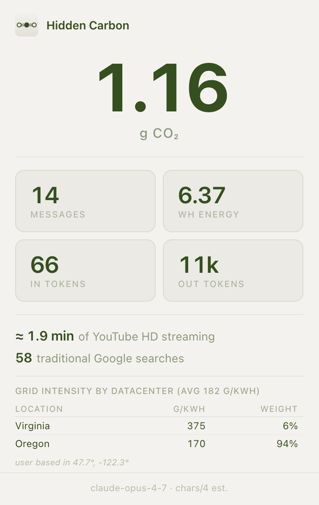

# Hidden Carbon: Making the Invisible Cost of LLMs Visible

*Lukas Diebold and Hari Sethuraman — University of Washington, CSE 599M (Sustainable & Ubiquitous AI), Spring 2026.*

Sending a message to Claude feels no different from texting a friend. The model thinks for a few seconds, types back, and you move on. What that thinking actually cost — the GPU time in a data center hundreds of miles away, the electricity it pulled off a real grid — never surfaces anywhere. You pay nothing per query. There's no meter. Nothing tells you whether a query weighs about the same as a Google search or about the same as streaming a movie. Hidden Carbon is a Chrome extension that tries to put a number on that cost for AI chat (Claude, ChatGPT, and Gemini), and anchors it to two things people already have a feel for: a traditional Google search and a minute of YouTube.

## Motivation

This started with a small, specific frustration. We'd both started leaning on LLMs every day, and we both suspected it carried a bigger environmental cost than the ordinary web browsing it was replacing — but neither of us could say how much bigger, even to an order of magnitude. So we went looking. The existing tools fell into two camps. Generic web extensions like [WebCarbon](https://www.websitecarbon.com/) and [Carbonalyser](https://github.com/carbonalyser/Carbonalyser) estimate emissions from data-transfer volume. That's a reasonable proxy for loading a static page, but it treats an LLM query — a few kilobytes over the wire, a GPU-second in the data center — as basically free. The AI-specific ones, like [GreenQuery](https://chromewebstore.google.com/detail/greenquery/ncbhfkcfbgmomklbimabfkoppejkibpp) and [Carbon ScaleDown](https://chromewebstore.google.com/detail/scaledown/jofapkamgblhjajlppnaiomcjhnllhnd), only cover ChatGPT, and they show the number on its own: a bare gram of CO₂ per message, which means very little without something familiar to hold it against. What we wanted didn't exist — a counter built for AI chat, calibrated against the everyday things people already have intuition for: a Google search and a minute of YouTube.

AI traffic is growing fast — OpenAI said ChatGPT was handling around 2.5 billion prompts a day by mid-2025 [5]. Meanwhile the public conversation runs on extremes: "a query boils a kettle," "training GPT-3 emitted hundreds of tons of CO₂," "0.2 g per search." Most of those trace back to old or contested sources. Someone who just wants to know which of their habits actually matter is left choosing between guilt-trip headlines and corporate sustainability PDFs.

So we kept the scope narrow. We're not trying to compute anyone's total digital footprint, and we're certainly not trying to be a carbon meter for the whole browser — doing that well means modelling devices, networks, idle infrastructure, and your local grid, and the answer would still probably be wrong. Hidden Carbon only looks at AI chat: Claude, ChatGPT, and Gemini, counted per conversation. Search and YouTube show up just as fixed reference points: published per-query and per-minute figures we use to put the AI number in units you already understand ("≈ 12 Google searches" or "≈ 3 minutes of HD YouTube"). The goal is awareness, a quiet meter you can glance at while you work, so you can feel the weight of an afternoon of Claude in terms you already know and decide for yourself whether it bothers you. Most of the work went into making that number something we could actually defend, and the rest of this post walks through it.

## What It Looks Like

Hidden Carbon lives in the toolbar. Open the popup on any Claude, ChatGPT, or Gemini tab and it shows the running total for the conversation you're in:



The big number is the headline — grams of CO₂ for everything said in this conversation so far. Under it are the pieces that produced it: message count, estimated energy in watt-hours, and input/output token counts. At the bottom are the two comparisons that give the number meaning. The session in the screenshot — 14 messages with Claude — came out to 2.55 g CO₂: about 4.2 minutes of HD YouTube, or 127 traditional Google searches. The footer notes which model it detected from the page and that tokens are estimated from character count.

That framing is the entire point. On its own, "2.55 g CO₂" means nothing to most people. "About four minutes of YouTube" is something you can actually feel.

## Methodology: What We Count

Before the numbers, a word on where we draw the system boundary, because it isn't the same for every service.

For AI chat and search, we count server-side energy only. For YouTube, we use an end-to-end figure that folds in the user's device and the network. That sounds inconsistent, but it tracks where the energy in each activity actually lives. The IEA's breakdown of video streaming puts about 72% of the energy in the viewing device, 23% in transmission, and only 5% in the data center — so counting the server alone would capture 5% of what streaming really costs. An LLM query is the mirror image: the GPU inference dominates, the handful of kilobytes of text is nothing, and your browser was already open, so rendering the reply costs essentially nothing extra. Search works the same way as the LLM.

Put more plainly, the rule we follow is to count the energy each activity distinctively causes and that grows with how much you use it. Streaming pulls megabytes a second the whole time you watch, so its device and network cost climb with every minute and exist only because you're streaming. A search or a chat turn moves almost nothing and ties up the server for a quick burst. Your device is on either way, so it isn't what sets these activities apart — what sets video apart is the continuous, time-scaling data it pulls down.

One limitation drops out of this. Because the boundaries differ, the comparison the extension shows ("≈ N min of YouTube HD") puts a server-side figure next to an end-to-end one. For conveying rough scale we think that's a fair trade, and it's consistent with the marginal-cost view we use everywhere else: we report what a given activity's content cost, not what the data center was ultimately billed for. Still, the boundaries aren't identical, and it's worth knowing that before reading too much precision into the comparison.

## How We Estimate Wh and CO₂

The extension gets to a number in three steps: count characters, turn those into an energy estimate, then convert energy to carbon using the grid the request likely ran on.

### Step 1: Character Counting and Token Estimation

Each content script watches the conversation and tallies raw characters by role — what the human typed versus what the assistant produced, including thinking tokens. We estimate tokens with the usual BPE rule of thumb:

$$\text{tokens} = \left\lceil \frac{\text{chars}}{4} \right\rceil$$

For English text that's good to about ±15%, comfortably inside the uncertainty of the energy factors below.

### Step 2: Energy from Tokens

Input tokens (prefill) run in parallel on the GPU and are much cheaper than output tokens, which come out one forward pass at a time. So:

$$\text{Wh} = \text{input\_tokens} \times 0.0001 + \text{output\_tokens} \times 0.0006$$

We calibrated these rates against Epoch AI (2025) [9], which puts a typical query — 500 output tokens, with the short input treated as negligible — at around 0.3 Wh. Our factors reproduce that: the `500 × 0.0006 = 0.30 Wh` output term carries the estimate, with a short prompt adding a negligible `100 × 0.0001 = 0.01 Wh`. The result lands in the same range as independent estimates — Google's disclosed 0.24 Wh median Gemini prompt [11] and Jegham et al.'s 0.42 Wh for a short GPT-4o query [10].

These are the *same* rates for all three services and every model behind them. There are no public per-token energy measurements broken down by model, so we can't defensibly assign Opus a different factor from Haiku, or GPT-4o a different one from a mini model — even though they plainly differ. We detect the model for the grid and display, but the energy factor stays fixed, and Jegham's figures suggest a single rate sits at the low end for the more capable models. Treat the per-query energy as a service-level estimate, not a per-model one.

These factors also assume the tokens we count are all the tokens the model produced. We count thinking-token *volume* when a model surfaces it (Step 1), but reasoning models can emit far more hidden tokens than they show, and energy scales with that hidden volume — so heavy-reasoning turns read low [12]. We return to this in the limitations.

### Step 3: Grid Carbon Intensity via Datacenter Weighting

To turn Wh into grams of CO₂, you need the carbon intensity of the grid feeding the data center that handled the request. We can't see which data center that was, but we do know which cloud each service runs on, and which US regions are plausible for consumer inference traffic:

| Service | Cloud Provider | US Regions |
|---------|---------------|------------|
| Claude | AWS | us-east-1 (Virginia), us-west-2 (Oregon) |
| ChatGPT | Azure | eastus (Virginia), eastus2 (Virginia), southcentralus (Texas), westus (California) |
| Gemini | GCP | us-central1 (Iowa), us-east4 (Virginia), us-west4 (Las Vegas) |

For each region we pull the current grid carbon intensity (gCO₂eq/kWh) from the [Electricity Maps API](https://www.electricitymaps.com/), which gives real-time, flow-traced numbers. It takes a cloud provider and region directly (e.g. `dataCenterProvider=aws&dataCenterRegion=us-east-1`), so we don't have to keep our own table mapping regions to grid zones.

From there we take a **weighted average** across a provider's data centers, weighting each one **inversely by its distance from the user**:

$$w_i = \frac{1}{d(\text{user},\, \text{dc}_i)} \qquad \overline{g}_{\text{CO}_2/\text{kWh}} = \frac{\sum_i w_i\, g_i}{\sum_i w_i}$$

The reasoning: providers route to nearby regions to keep latency down, so a user in Seattle is far likelier to land in Oregon (280 km) than Virginia (3,700 km). Inverse-distance weighting captures that without us having to know the real routing policy. Distances come from the haversine formula, using the user's location and the known data-center coordinates.

The final step is just:

$$g_{\text{CO}_2} = \frac{\text{Wh}}{1000} \times \overline{g}_{\text{CO}_2/\text{kWh}}$$

We cache the grid intensities locally and refresh them once a day with a background alarm, so the extension makes at most ~9 API calls every 24 hours. If there's nothing cached yet — say, right after install — we fall back to the Ember 2024 global average of 400 gCO₂/kWh.

### What This Counts (and Doesn't)

This is a **marginal-cost** view. We only count what the user typed and what the model wrote back in this conversation. We leave out, on purpose:

- **Prefill** — the system prompt, tool schemas, and chat history the service feeds the model on every turn. Most of it is prompt-cached server-side anyway, and charging the full prefill to each message would make every query look identical no matter what the user actually did.
- **Training** — handled in its own section below.

So the number to keep in mind is: what did *this conversation's content* cost the grid?

## Where Our Search Energy Figure Comes From

For search we use **0.02 g CO₂ per query**, from Vanderbauwhede (2024) [2]. They start from Google's 2009 self-reported 0.0003 kWh per query and update it for the three things that have actually changed since: roughly a 6.7× gain in server efficiency (extrapolated from the 4.17× Masanet et al. measured over 2010–2018 [1]), Google's PUE dropping from 1.16 to 1.10, and a US grid running around 367 gCO₂/kWh. That lands about 10× below the 0.2 g figure people still quote from 2009.

One thing to be clear about: this is *conventional* search, not the AI Overviews Google now staples to the top of so many results. Vanderbauwhede puts the AI-augmented path at 60–75× more, and a browser extension can't tell whether a given query triggered an Overview. Sticking with the conventional number gives us a steady reference point and a sensible lower bound on what search costs once generative AI gets layered on.

## Where Our YouTube Figure Comes From

For YouTube we use **36 g CO₂ per hour** — about **0.6 g per minute** — from the IEA's work on video-streaming energy [3].

Streaming has its own history of inflated numbers. A 2019 Shift Project report claimed it emitted up to 6 kg CO₂ an hour, and that figure traveled a long way before someone caught a unit-conversion error in it. The IEA went back over the claim in 2020, used actual data-center and network energy intensity measured per unit of time rather than per gigabyte, and landed on 36 g CO₂/hr against a global-average grid. It's the most credible independent estimate we found, and it has held up against later analyses.

There's a structural caveat. As noted in the methodology, most of streaming's energy lives in the viewing device rather than the data center — which means the real per-minute number depends heavily on what you're watching it on. A laptop and a 50-inch TV can differ fivefold in power draw. We can't see the user's screen, so we just apply the IEA composite as a reasonable middle. And as with search, the grid caveat holds: anyone on a cleaner grid has a lower true footprint than this number implies.

## An Alternative Cross-Check: A Spend-Based Estimate

Everything so far is process-based LCA: we build up the physical energy of an activity from the bottom. There's a second tradition — economic input-output LCA, which the GHG Protocol formalizes as the spend-based method — that works the other direction, from money. You take what was paid for a service and multiply by a sector emission factor in kg CO₂e per dollar. We ran it as a check against our per-token numbers, and what came out was interesting enough to write down.

The factor comes from the EPA's USEEIO-based Supply Chain GHG Emission Factors (2022 data, 2022 USD) [4], for the commodity that covers AI inference: NAICS 518210, "Data processing, hosting, and related services." That row reports **0.064 kg CO₂e/$** — the with-margins and without-margins values are the same at this precision, since data hosting doesn't carry the wholesale/retail markup that splits them apart for physical goods. We use the API price as the spend basis rather than a subscription, because it's observable and scales with usage.

For the rest of this post we settle on one representative working turn: **500 input and 1,000 output tokens** — a few sentences of prompt plus a roughly 750-word reply. That's deliberately heavier than the bare calibration query above (Epoch's minimal-input, 500-output reference point), because a real chat turn carries some context and tends to produce a longer answer. For a single Claude Sonnet 4.6 turn at this shape, at $3 / $15 per million tokens, the spend-based estimate is:

```
Spend = (500/1e6 × $3) + (1000/1e6 × $15) = $0.0165
EIO   = $0.0165 × 0.064 kgCO₂e/$          ≈ 1.06 g CO₂e
```

And bottom-up — our own formula, same tokens, using the weighted grid intensity for Claude from Electricity Maps (about 231 gCO₂/kWh as of May 2026):

```
Wh    = 500 × 0.0001 + 1000 × 0.0006 = 0.65 Wh
gCO₂  = 0.65 / 1000 × 231             ≈ 0.15 g CO₂
```

The spend-based number comes in about 7× higher. For a sector this young, a top-down economic estimate and a bottom-up physical one disagreeing by nearly an order of magnitude is about what you'd expect — but the odd part is that we can't even say which way the error runs. The textbook reading is that spend-based overestimates, because the price carries margin, training, and overhead the factor scores at economy-average intensity — dollars that buy no inference electricity. That assumes price sits above cost. But the big labs are reportedly pricing inference below cost to grab market share, and if investor capital subsidizes each dollar of spend, a dollar buys *more* compute, and more emissions, than it would at the mature hosting providers the EPA factor is built from. Which effect wins is company-specific and shifting month to month as prices fall. So the spend-based figure is best read not as a second emissions estimate but as a measure of how far price has decoupled from physical resource use in this corner of the economy.

That decoupling also kills the one job spend-based usually does best: recovering the amortized training and hardware emissions a use-phase model misses. In a normal sector the price embeds those costs, so the factor recovers them; here it doesn't, because investors are eating the training cost. And the method is blind to free services — search, YouTube, and DuckDuckGo cost the user nothing, so it scores them at roughly zero. Both are why we keep it as a cross-check rather than the primary method.

### What About Training?

Our per-query numbers are use-phase inference only. Does amortizing training back across the queries a model serves change the picture much?

The per-model approach — a published training footprint divided by lifetime queries — comes out tiny. GPT-4 emitted about 5,184 tCO₂e [8]; assume it handled ~1 billion queries a day over a six-month run as flagship — a conservative fraction of ChatGPT's ~2.5 billion daily prompts [5], since that traffic is split across several models and GPT-4 was never the only one serving:

```
5,184 tCO₂e × 10⁶ g/t   = 5.18 × 10⁹ g training
1×10⁹ queries/day × 182 = 1.82 × 10¹¹ queries served
Amortized: 5.18×10⁹ / 1.82×10¹¹ ≈ 0.028 g / query
```

That's under 0.03 g — a rounding error on a query of a couple tenths of a gram. It's also an underestimate, because it lowballs both terms: published footprints cover only the *final* training run (not the failed runs, sweeps, and prior generations behind it), and the denominator is a guessed queries-per-day times a guessed service life.

The **inference-to-training energy ratio** at the industry level sidesteps both — it folds failed runs and R&D into the training side automatically, and uses real serving load on the inference side. Patterson et al. (2022) put Google's ML workload at ~60% inference / 40% training over 2019–2021, "research, development, testing, and production" included [6]: a `1.67×` multiplier on use-phase. McKinsey's 2026 modelling has industry-wide capacity at ~31 GW training vs. ~31 GW inference [7]: a `2.0×` multiplier, projected to ease back toward ~1.7× by 2030 as inference scales. (Both are industry-wide ratios — frontier labs still pre-training flat-out likely sit at the high end, and McKinsey's figure is power *capacity*, a rough proxy for energy.)

So a defensible amortized-training multiplier is roughly **1.7–2× in 2026**. On our representative 0.15 g use-phase query that puts the lifecycle total around **0.25–0.30 g CO₂e** — still well under the spend-based 1.06 g. The worry from the last section stands — spend-based can't recover training emissions while investors absorb them — but what use-phase misses is a small multiplier, not an order of magnitude. For low-traffic models, where training can dominate the lifecycle, that flips.

## What We Don't Capture, and Where Your Data Goes

A few limits, collected in one place rather than scattered through the post:

- **Hidden reasoning tokens.** We count thinking-token volume when it's exposed, but a model that reasons without surfacing the tokens emits energy-bearing output we can't see, so heavy chain-of-thought turns read low.
- **One grid snapshot.** We refresh grid intensity once a day and weight regions by distance; we can't see how an individual request was actually routed, and before the first refresh we fall back to a 400 gCO₂/kWh global average.
- **The energy factors themselves.** The 0.0001 / 0.0006 Wh-per-token rates are public estimates, not measurements from inside the labs, and they're fixed per service rather than per model.
- **Text only.** We tally characters, so images, audio, and other multimodal input or output aren't modelled — a vision or voice turn is counted only by whatever text rides along with it.
- **Carbon only.** We count operational CO₂e. The water data centers draw for cooling — the subject of many of the headlines that prompted this project — and the embodied emissions of the hardware itself are both real and both out of scope here.

On privacy, the short version is that almost nothing leaves your browser. Your stats and your location are kept in the extension's local storage and are never uploaded. The one outbound request goes to the Electricity Maps API, and it carries only a cloud provider and region name (e.g. `aws` / `us-east-1`) — not your coordinates, and nothing you typed. Geolocation is used purely on-device, to weight nearby data centers more heavily in the average.

## So, Should You Worry?

The answer our own tool keeps handing back is: less than the headlines imply, but not nothing. A single Claude turn lands around 0.15 g CO₂ on a typical grid, and a long working session is a few grams. In the units the extension shows, an afternoon of heavy use is on the order of a hundred-odd Google searches or a few minutes of streaming — real, but dwarfed by a short car trip. Fold in amortized training and the lifecycle figure is maybe 1.7–2× higher, still the same ballpark.

That is roughly the opposite of the "every query boils a kettle" framing, and it's the result we most wanted to be able to stand behind. Hidden Carbon was never meant to make anyone feel guilty for asking a model a question. It was meant to swap a vague unease for a number you can check, in units you already understand, right when you're deciding whether to hit enter.

Where the figure does get large is in aggregate — billions of queries a day, and the data-center build-out behind them — neither of which a per-conversation meter can show. That, we think, is the honest place to point concern: not at the single query, but at the scale.

Hidden Carbon is in beta. The code, and instructions for loading the extension, are on GitHub: [github.com/lukasdiebold/hiddencarbon](https://github.com/lukasdiebold/hiddencarbon).

---

[1] Masanet, E., Shehabi, A., Lei, N., Smith, S., & Koomey, J. (2020). Recalibrating global data center energy-use estimates. *Science*, 367(6481), 984–986. https://doi.org/10.1126/science.aba3758

[2] Vanderbauwhede, W. (2024). Estimating the increase in emissions caused by AI-augmented search. arXiv:2407.16894. https://arxiv.org/abs/2407.16894

[3] Kamiya, G. (2020). The carbon footprint of streaming video: fact-checking the headlines. IEA Commentary. https://www.iea.org/commentaries/the-carbon-footprint-of-streaming-video-fact-checking-the-headlines

[4] U.S. Environmental Protection Agency (2024). Supply Chain Greenhouse Gas Emission Factors v1.3 by NAICS-6 (2022 data, 2022 USD), based on the USEEIO model. https://catalog.data.gov/dataset/supply-chain-greenhouse-gas-emission-factors-v1-3-by-naics-6

[5] OpenAI / S. Altman, via Axios (July 2025). ChatGPT receives 2.5 billion prompts per day. https://www.axios.com/2025/07/21/chatgpt-users-prompts-2-5-billion

[6] Patterson, D., Gonzalez, J., Hölzle, U., Le, Q., Liang, C., Munguia, L.-M., Rothchild, D., So, D., Texier, M., & Dean, J. (2022). The carbon footprint of machine learning training will plateau, then shrink. *Computer*, 55(7), 18–28. https://doi.org/10.1109/MC.2022.3148714

[7] McKinsey & Company (2025). The future of AI workloads. https://www.mckinsey.com/featured-insights/week-in-charts/the-future-of-ai-workloads

[8] Stanford Institute for Human-Centered AI (2026). *The AI Index 2026 Annual Report*. Figure 1.4.3, estimated CO₂ equivalent emissions of select machine learning models (GPT-4 ≈ 5,184 tonnes). https://hai.stanford.edu/ai-index

[9] Epoch AI (2025). How much energy does ChatGPT use? *Gradient Updates*, Feb 7, 2025. https://epoch.ai/gradient-updates/how-much-energy-does-chatgpt-use

[10] Jegham, N., Abdelatti, M., Elmoubarki, L., & Hendawi, A. (2025). How Hungry is AI? Benchmarking Energy, Water, and Carbon Footprint of LLM Inference. arXiv:2505.09598. https://arxiv.org/abs/2505.09598

[11] Google (2025). *Measuring the Environmental Impact of Delivering AI at Google Scale*. Median Gemini Apps text prompt ≈ 0.24 Wh. https://services.google.com/fh/files/misc/measuring_the_environmental_impact_of_delivering_ai_at_google_scale.pdf

[12] Jin, Y., Wei, G.-Y., & Brooks, D. (2025). The Energy Cost of Reasoning: Analyzing Energy Usage in LLMs with Test-time Compute. arXiv:2505.14733. https://arxiv.org/abs/2505.14733
